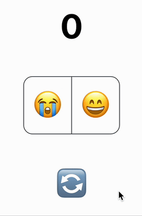

# emoji-count

In this lab, we will learn how to update and reset a simple counter by 1.

> Useful links:
>
> - [CSS - MDN docs](https://developer.mozilla.org/en-US/docs/Web/CSS)
> - [HTML & CSS - Internetingishard](https://internetingishard.netlify.app/html-and-css/)
> - [styled-components](https://styled-components.com/docs/api#styled)
